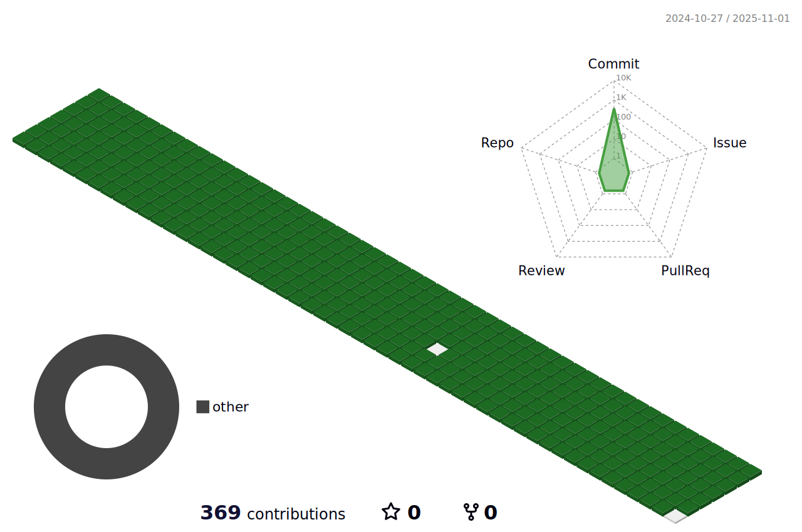

### Hi there 👋
- 🌱 I’m currently learning Algorithm, web(Back-end), unity, deep learning 
- 💬 Ask me about Korean C++ Programmer
- 📫 How to reach me: Kakao Talk  
  - Kakao Talk ID : jongwan0121
  - Email : lee2003121@naver.com
- ⚡ Fun fact: Game Programming and Game Play

## 🛠 Technologies & Tools
<h3>OS</h3>

  

<h3>Code</h3>

  
  

<h3>Tools</h3>

	
  
  
  
  

<h3>DataBase</h3>

  
   

## ⚡ My Achievements

